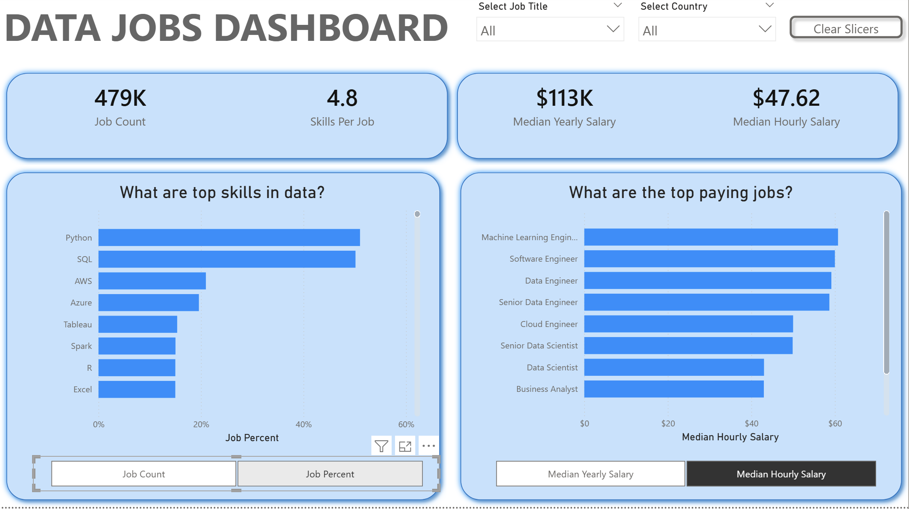

# Data Jobs Dashboard (v2.0) – Skills Demand & Compensation

## Introduction

Version 2.0 of the Data Jobs Dashboard is a **single-page, insight-focused report** built for **job seekers, job transitioners, and job swappers**. It aims to quickly answer two core questions:

1. Which skills matter most in the data job market?
2. Which data roles pay the most, and how does that change between yearly and hourly salary views?

The dashboard uses the same 2024 data job postings dataset as v1, but shifts the emphasis from time trends and drill-through to **skills and compensation comparisons**.

---

## Dataset & Context

- Real-world 2024 data job postings
- Dimensions used prominently:
  - Job title
  - Country
  - Skills
- Measures:
  - Job Count
  - Skill Count
  - Skills Per Job
  - Median Yearly Salary
  - Median Hourly Salary
  - Job Percent (share of postings mentioning a skill)

A star-schema-style model (fact + dimensions for skills, companies, schedule types) supports flexible analysis.

---

## Business Questions

This version is optimized to answer:

1. **Demand**
   - How many jobs exist in total?
   - On average, how many skills are required per job?

2. **Skills**
   - Which skills are most frequently requested?
   - How does skill popularity change when viewed as:
     - Absolute job count vs
     - Percentage of all jobs?

3. **Compensation**
   - Which job titles have the highest median yearly salary?
   - Which job titles have the highest median hourly salary?
   - How do rankings change when switching between yearly and hourly perspectives?

4. **Segmentation**
   - How do these insights change when filtered by:
     - Job Title
     - Country?

---

## Dashboard Structure

The single page is organized into three main zones:

### 1. KPI Strip (Top)

- **Job Count**
- **Average Skills Per Job**
- **Median Yearly Salary**
- **Median Hourly Salary**

These metrics set the context for the rest of the page.

### 2. Filters (Top-Center)

- **Job Title slicer**
- **Country slicer**
- **Clear Slicers button**

These control the slice of the market being analyzed.

### 3. Skills & Salary Insights (Middle)

- **Top Skills in Data**
  - Horizontal bar chart of skills
  - Field/measure parameter to toggle between:
    - Job Count
    - Job Percent
  - Helps identify high-demand skills and their relative importance

- **Top Paying Jobs**
  - Horizontal bar chart of job titles
  - Measure parameter to toggle between:
    - Median Yearly Salary
    - Median Hourly Salary
  - Highlights the most lucrative roles under different pay perspectives

---

## Skills & Techniques Demonstrated

- **Power Query**
  - Data cleaning and preparation of job and skill data

- **Data Modeling (Star Schema Principles)**
  - Fact table for job postings
  - Dimension tables:
    - Skills
    - Companies
    - Schedule types
  - Relationship design to support flexible slicing

- **DAX**
  - Measures for:
    - Job Count
    - Skill Count
    - Skills Per Job
    - Median Yearly / Hourly Salary
    - Job Percent

- **Field / Measure Parameters**
  - Dynamic switching between:
    - Job Count vs Job Percent (skills chart)
    - Yearly vs Hourly median salary (jobs chart)

- **Visual & UX Design**
  - Compact, single-page layout
  - Consistent color palette and typography
  - Use of cards, bar charts, and toggles for fast interpretation

---

## Screenshot

- **Single-page Skills & Salary Dashboard**

  

---

## Summary

Version 2.0 reframes the same dataset to focus on **skills demand and compensation**, making it ideal for:

- Job seekers deciding which skills to prioritize,
- Career changers comparing roles,
- And stakeholders who want a concise, single-page view of the data job market.

Where v1 emphasizes **trend monitoring and drill-through**, v2 emphasizes **ranking, comparison, and quick insight** on one screen.
